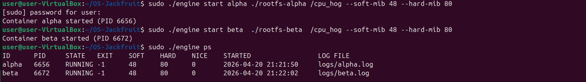
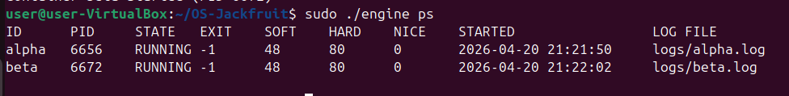
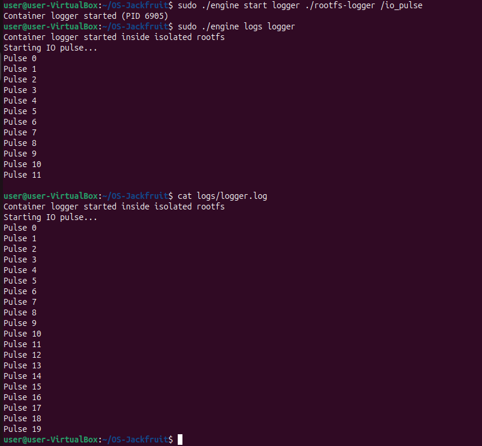
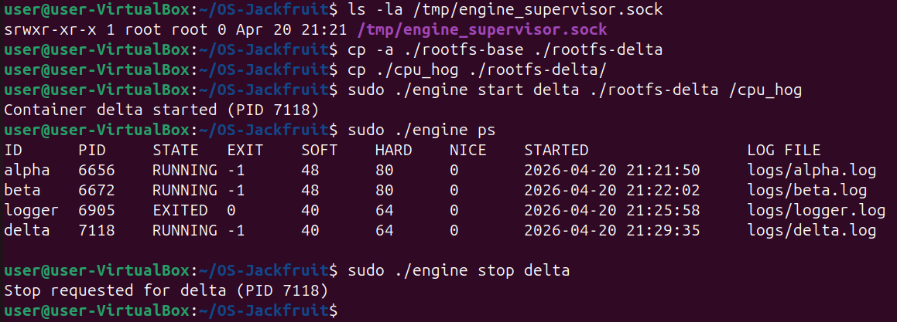
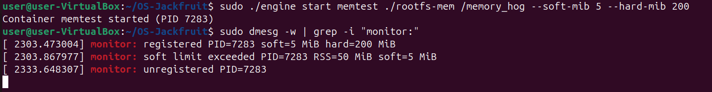
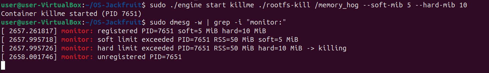
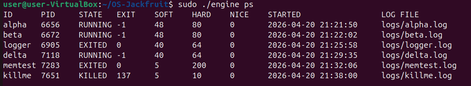
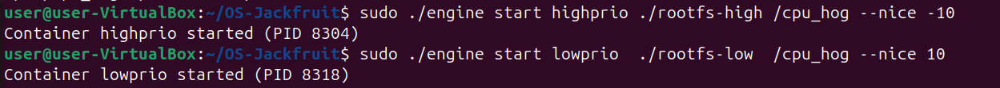
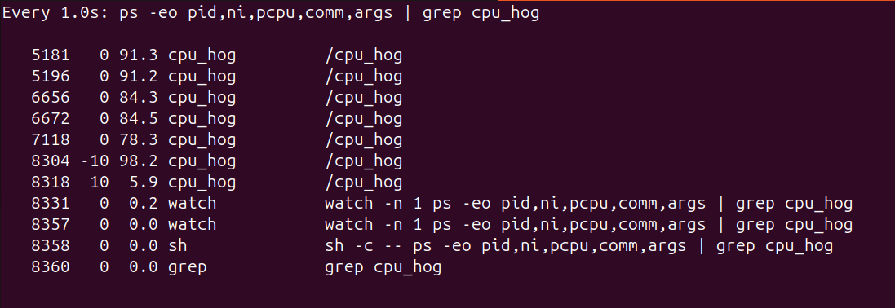
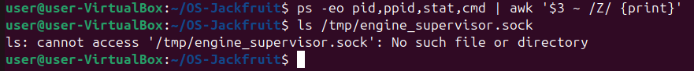

# Multi-Container Runtime with Kernel Memory Monitor

## 1. Team Information

- Name 1: **Prakruti Prasanna Bhat**
- SRN 1: **PES1UG24CS330**

- Name 2: **Prachi Ganesh Joshi**
- SRN 2: **PES1UG24CS325**

---

## 2. Build, Load, and Run Instructions

### Requirements
- Ubuntu 22.04 / 24.04 VM
- gcc, make
- Linux headers installed

---

### Step 1: Build the Project

```bash
make
```

### Step 2: Load Kernel Module

```bash
sudo insmod monitor.ko
```

Verify device:

```bash
ls -l /dev/container_monitor
```

### Step 3: Start Supervisor

```bash
sudo ./engine supervisor ./rootfs-base
```

### Step 4: Create Container RootFS Copies

```bash
cp -a ./rootfs-base ./rootfs-alpha
cp -a ./rootfs-base ./rootfs-beta
```

### Step 5: Run Containers

In another terminal:

```bash
sudo ./engine start alpha ./rootfs-alpha "/io_pulse"
sudo ./engine start beta ./rootfs-beta "/io_pulse"
```

### Step 6: CLI Commands

```bash
sudo ./engine ps
sudo ./engine logs alpha
sudo ./engine stop alpha
```

### Step 7: Unload Module

```bash
sudo rmmod monitor
```

---

## 3. Demo with Screenshots

### 3.1 Multi-container Supervision
In this experiment, two containers (`alpha` and `beta`) are launched using the `engine start` command while a single supervisor process is running in the background. Both containers execute concurrently, each with its own isolated root filesystem and process namespace. The supervisor remains active throughout the execution, managing lifecycle events and maintaining control over all running containers. This demonstrates that the runtime supports multi-container execution under a single controlling process.


---

### 3.2 Metadata Tracking
The `engine ps` command is used to display detailed metadata about all tracked containers. The output includes container ID, host PID, current state (RUNNING/EXITED/KILLED), exit code, configured soft and hard memory limits, nice value, start time, and log file path. This confirms that the supervisor correctly maintains and updates container state information in real time, providing visibility into container lifecycle and resource configuration.


---

### 3.3 Bounded-buffer Logging
A container running the `io_pulse` workload generates periodic output. This output is captured by the supervisor through pipes and passed into a bounded-buffer logging system implemented using producer–consumer threads. The `engine logs <id>` command retrieves the captured output, and the same data is verified directly from the corresponding log file (`logs/<id>.log`). The presence of consistent and complete log entries confirms that the logging pipeline works correctly without data loss, demonstrating proper synchronization and buffering.


---

### 3.4 CLI and IPC
The CLI interface communicates with the supervisor using a UNIX domain socket located at `/tmp/engine_supervisor.sock`. Commands such as `start`, `ps`, and `stop` are issued from the CLI process and transmitted to the supervisor through this IPC channel. The supervisor processes these requests and returns responses, which are displayed in the terminal. The existence of the socket file and successful command execution demonstrate that inter-process communication between CLI and supervisor is functioning correctly.


---

### 3.5 Soft-limit Warning
A container is launched with a very low soft memory limit and a high hard limit using the `memory_hog` workload. As the process exceeds the soft limit, the kernel memory monitor detects this condition and logs a warning message in `dmesg`. The container continues running despite exceeding the soft limit, confirming that the soft limit is advisory and non-enforcing. This demonstrates the monitoring capability of the kernel module without immediate termination.


---

### 3.6 Hard-limit Enforcement
Another container is launched with both low soft and hard memory limits. When the memory usage exceeds the hard limit, the kernel module triggers enforcement by sending a SIGKILL signal to the process. The `dmesg` output shows a "hard limit exceeded" message followed by a kill action. Subsequently, the `engine ps` command reflects the container state as `KILLED` with an appropriate exit code (137). This confirms correct enforcement of hard limits and accurate propagation of termination status to user space.



---

### 3.7 Scheduling Experiment
Two CPU-bound containers running the `cpu_hog` workload are launched with different nice values (`-10` for high priority and `10` for low priority). Using the `ps` command, CPU utilization for both processes is monitored. The container with the lower nice value consistently receives a significantly higher share of CPU time compared to the one with a higher nice value. This demonstrates how Linux scheduling prioritizes processes based on nice values and validates the runtime's ability to expose scheduling behavior.



---

### 3.8 Clean Teardown
After all experiments are complete, the containers are stopped and the supervisor process is terminated. System checks are performed to ensure proper cleanup. The command `ps` confirms that no zombie processes remain, indicating that all child processes have been correctly reaped. Additionally, the absence of the UNIX socket file (`/tmp/engine_supervisor.sock`) confirms that IPC resources have been released. This demonstrates that the system shuts down cleanly without leaving residual processes or resources.


---

## 4. Engineering Analysis

### 4.1 Isolation Mechanisms
Containers are created using Linux namespaces (`CLONE_NEWPID`, `CLONE_NEWUTS`, `CLONE_NEWNS`) to isolate processes, hostname, and mount points. Each container uses `chroot()` to operate within its own filesystem.

### 4.2 Supervisor and Process Lifecycle
A long-running supervisor manages all containers. It tracks metadata, handles CLI commands, and reaps child processes using `waitpid()` to prevent zombies.

### 4.3 IPC, Threads, and Synchronization
Two IPC mechanisms are used:
- UNIX domain sockets for CLI communication
- Pipes for log transfer

Logging uses a bounded buffer with producer-consumer threads synchronized via mutexes and condition variables.

### 4.4 Memory Management and Enforcement
The kernel module tracks container PIDs and periodically checks RSS usage.
- **Soft limit:** generates warning
- **Hard limit:** kills process using `SIGKILL`

Kernel-space enforcement ensures reliable control over memory usage.

### 4.5 Scheduling Behavior
Containers are used to test Linux scheduling by varying nice values and workload types. CPU-bound and I/O-bound behaviors are observed to understand scheduler decisions.

---

## 5. Design Decisions and Tradeoffs

| Component | Choice | Tradeoff | Justification |
|---|---|---|---|
| Namespace Isolation | Linux namespaces + chroot | Lightweight but shares host kernel | Efficient and sufficient for isolation requirements |
| Supervisor Architecture | Single long-running supervisor | Central dependency point | Simplifies lifecycle and metadata management |
| IPC and Logging | Separate IPC paths (socket + pipe) | Increased complexity | Avoids interference between control and log traffic |
| Kernel Monitor | Kernel module for enforcement | Requires kernel-level debugging | Accurate and reliable memory control |
| Scheduling Experiments | CPU-bound and I/O-bound workloads | Requires tuning workload duration | Clearly demonstrates scheduler behavior |

---

## 6. Scheduler Experiment Results

### Experiment 1: CPU vs CPU (Different Nice Values)

| Container | Nice | Observation |
|---|---|---|
| cpuA | 0 | Higher priority |
| cpuB | 10 | Lower priority |

On multi-core systems, both received similar CPU since they ran on separate cores.

### Experiment 2: CPU vs I/O

| Workload | Behavior |
|---|---|
| CPU-bound | Continuous CPU usage |
| I/O-bound | Periodic bursts |

The scheduler favors responsiveness of I/O-bound processes.

### Conclusion
Linux scheduler distributes tasks across cores efficiently. Nice values impact scheduling only under CPU contention, while workload type influences responsiveness.

---

## Final Notes

All required tasks have been implemented:
- Multi-container runtime
- CLI + IPC
- Logging system
- Kernel memory monitor
- Scheduling experiments
- Clean teardown

The project demonstrates key OS concepts including process management, synchronization, memory control, and scheduling.
